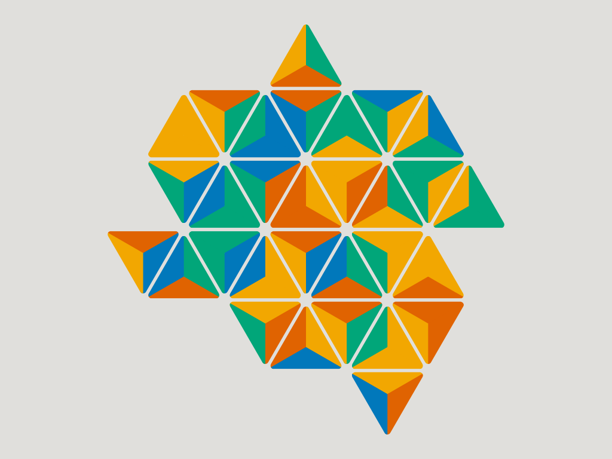
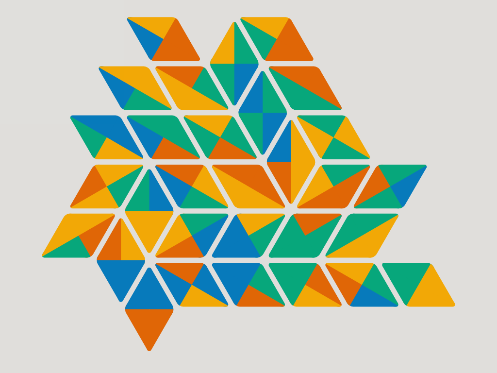
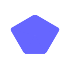
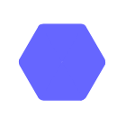
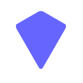
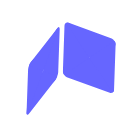
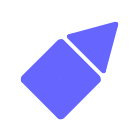
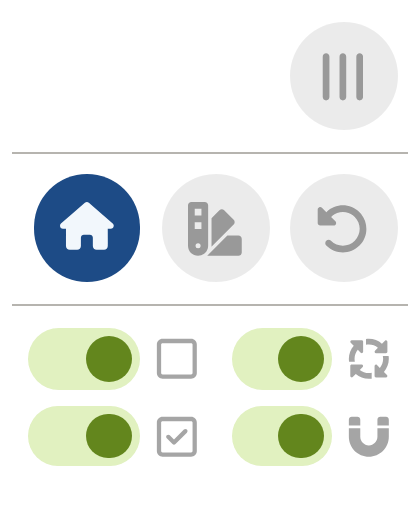
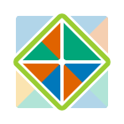
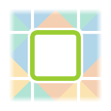

<div align="center">
<h1><a href="https://tessel.vantulder.net/"></a></h1>

_A game by <a href="https://www.vantulder.net/">Gijs van Tulder</a>_

**[Play online!]** • [Tilings] • [Settings] • [Custom game] • [Development]

[Play online!]: https://tessel.vantulder.net/
[Tilings]: #tilings
[Settings]: #settings
[Custom game]: #play-a-custom-game
[Development]: #development

Place tiles with matching colors to make shapes and fill the board.

   

</div>

## Tilings

Play one of the nine tiling patterns:

| <br/>Square | <br/>Triangle | <br/>Rhombus |
| ---------------------------------------------------------------------- | -------------------------------------------------------------------------- | ------------------------------------------------------------------------ |
|            |              |             |
| [Wikipedia](https://en.wikipedia.org/wiki/Square_tiling)               | [Wikipedia](https://en.wikipedia.org/wiki/Triangular_tiling)               | [Wikipedia](https://en.wikipedia.org/wiki/Rhombille_tiling)              |

| <br/>Cairo pentagonal | <br/>Hexagonal |  <br/> Deltoidal-trihexagonal      |
| ---------------------------------------------------------------------------------- | -------------------------------------------------------------------------- | -------------------------------------------------------------------------------------------------- |
|                      |               |                                   |
| [Wikipedia](https://en.wikipedia.org/wiki/Cairo_pentagonal_tiling)                 | [Wikipedia](https://en.wikipedia.org/wiki/Hexagonal_tiling)                | [Wikipedia](https://en.wikipedia.org/wiki/Rhombitrihexagonal_tiling#Deltoidal_trihexagonal_tiling) |

|  <br/>Penrose P3    |  <br/>Snub square |  <br/> Ammann-Beenker |
| ------------------------------------------------------------------------------- | -------------------------------------------------------------------------------- | --------------------------------------------------------------------------------------- |
|                    |                  |                      |
| [Wikipedia](<https://en.wikipedia.org/wiki/Penrose_tiling#Rhombus_tiling_(P3)>) | [Wikipedia](https://en.wikipedia.org/wiki/Snub_square_tiling)                    | [Wikipedia](https://en.wikipedia.org/wiki/Ammann%E2%80%93Beenker_tiling)                |

## Settings

Click the hamburger menu to change the settings of the current game:



| Option                                                               | Action                                        |
| -------------------------------------------------------------------- | --------------------------------------------- |
|          | Return to the main menu.                      |
|               | Choose a custom tiling and rules.             |
|             | Restart the current game.                     |
|  | Show all tile outlines.                       |
|        | Show where the current tile can be placed.    |
|   | Automatically rotate the tile to make it fit. |
|         | Snap tiles into place while dragging.         |

## Play a custom game

Customize shapes and colors in the design menu:


### Tiling

|  |  |  |  |  |
| ----------------------------------------------------------- | ------------------------------------------------------------- | ------------------------------------------------------------ | ------------------------------------------------------------- | ------------------------------------------------------------ |
| Square                                                      | Triangle                                                      | Rhombus                                                      | Pentagon                                                      | Hexagon                                                      |

|  |  |  |  |
| ---------------------------------------------------------------- | ------------------------------------------------------------ | --------------------------------------------------------------- | ------------------------------------------------------------------ |
| Deltoidal-<br/>trihexagonal                                      | Penrose                                                      | Snub<br/>square                                                 | Ammann-<br/>Beenker                                                |

### Number of colors

|  |  |  |  |  |
| --------------------------------------------------------------- | ---------------------------------------------------------------- | ---------------------------------------------------------------- | ----------------------------------------------------------------- | --------------------------------------------------------------- |
| Six                                                             | Five                                                             | Four                                                             | Three                                                             | Two                                                             |

### Tile colorings

|  |  |  |  |
| ------------------------------------------------------------------- | ---------------------------------------------------------------------- | ------------------------------------------------------------------- | ---------------------------------------------------------------------- |
| Mixed                                                               | All unique                                                             | Two colors                                                          | Single color                                                           |

### Matching rule

|  |  |
| -------------------------------------------------------------------- | ------------------------------------------------------------------------- |
| Touching tiles<br/>must have the <br/>same color                     | Touching tiles <br/>must have <br/>different colors                       |

### Scoring rule

|  |  |  |  |  |
| -------------------------------------------------------------------- | ---------------------------------------------------------------------- | ----------------------------------------------------------------------- | ---------------------------------------------------------------------- | ---------------------------------------------------------------- |
| Closed area                                                          | Single tile                                                            | Convex shape                                                            | Full vertex                                                            | Holes                                                            |

## Development

Tessel is written in TypeScript and based on HTML, SVG and CSS.

Use NPM to install the required dependencies:

```
npm ci
```

Run a local development server:

```
npm run serve
```

Run all tests:

```
npm run test
```

## License

Copyright © 2025 by [Gijs van Tulder](https://www.vantulder.net/).

The source code of this game is licensed under the [GPL-3.0 license](LICENSE.md).
